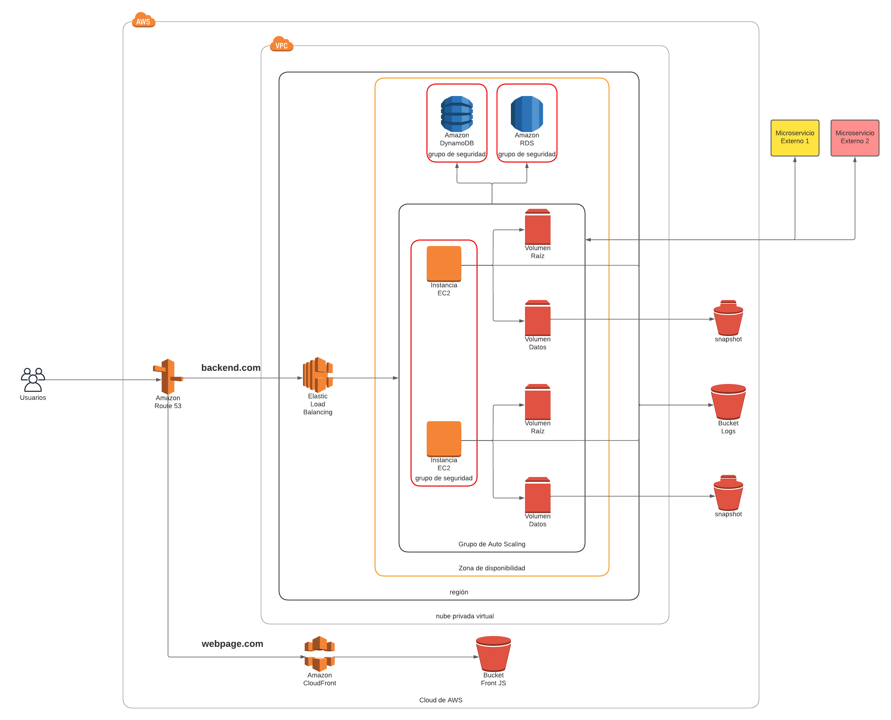

# Prueba 1 - Zabalza Inaki

En la imagen se presenta el diagrama de red propuesto. Los usuarios finales se conectarán al frontend a través de un CNAME (en este caso webpage.com) que estará administrado por Route 53. Este servicio se encargará de resolver el tráfico de dicho CNAME a la distribución de Cloudfront correspondiente. Cloudfront implementará una CDN para distribuir el contenido del frontend a través del mundo. Este contenido en este caso se encontrará alojado en un bucket de S3 (suponiendo por ejemplo que se trate de un sitio web tipo SPA, donde el usuario descarga el contenido del sitio y lo ejecuta en su navegador). El código del frontend implementará la comunicación con el backend, que estará corriendo en instancias de EC2. Esta comunicación se realizará mediante llamadas a un endpoint (por ejemplo backend.com) configurado como CNAME en Route 53, que dirigirá el tráfico hacia un balanceador de carga implementado en el servicio de Elastic Load Balancing (según los requerimientos, podría se uno clásico, de aplicación o de red, por ejemplo). El balanceador de carga tomará las solicitudes y las enviará a las instancias de EC2 para su procesamiento, garantizando un correcto funcionamiento ante cargas variables, ya que tendrá en cuenta de qué manera distribuir la carga. 

Las instancias pertenecen en su totalidad a un grupo de autoscaling. Estos grupos permiten configurar escalado automático de instancias ante diferentes condiciones para garantizar el correcto funcionamiento de la aplicación al menor costo, lo cual garantiza dos cosas:

- Alta disponibilidad: debido a que si una de las instancias sufre una caída o entra en un estado de error, se podrían habilitar otras automáticamente. Además, en este caso se decidió tener un mínimo de dos instancias, aumentando la HA, así como tambien optimizando el uso de soluciones distribuidas.

- Soportar cargas variables: ya que en los momentos de más tráfico, podría aumentarse el número de instancias, mientras que en los momentos de menos tráfico podrían reducirse. 

Por otro lado se optó por usar dos volúmenes de almacenamiento para las instancias: uno para la raíz, y otro para los datos. De esta manera se realizarán snapshots para almacenar la información relevante de la instancia en caso de ser necesario.
También se utilizará otro bucket de S3 para el almacenamiento de logs de las instancias.
El backend además se comunica con dos servicios de AWS: DynamoDB, que permite implementar bases de datos no relacionales, y RDS, que permite implementar bases de datos relacionales.
Tanto las bases de datos como las instancias de EC2 cuentan con un grupo de seguridad asociado para permitir únicamente el tráfico necesario para el correcto funcionamiento de la aplicación, y denegar cualquier otra conexión.
Por último, las instancias consumirán los microservicios alojados fuera de la nube de AWS.